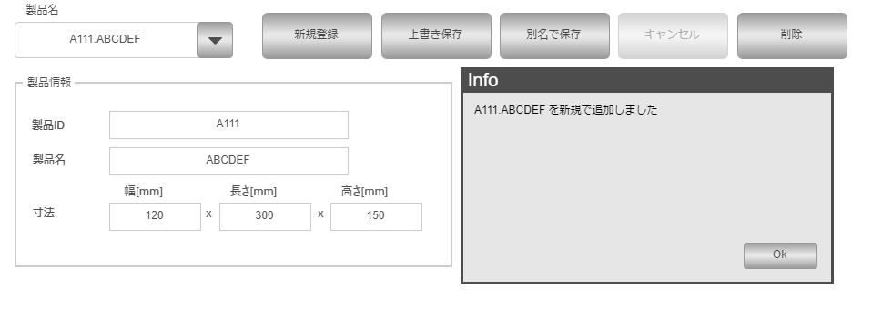

# CODESYS_HashTable_Struct_Example

CODESYSでSTRING型をKeyとし、独自の構造体をValueとしてHashTableで管理する方法のサンプルプログラムです。
HashTableの動きをわかりやすくするためのVisualizationも作成しています。

Qiitaに投稿した以下記事のサンプルプログラムとして作成しています。  
[CODESYSで任意の構造体でのMap（HashTable）実装](https://qiita.com/enakata06/private/0c43ca74ccaf2fcd8e5d)

## 開発環境
 
- CODESYS V3.5 SP20 Patch3

## ライセンス

このプロジェクトは [MIT License](./LICENSE) の下で公開されています。

### MITライセンスについて

MITライセンスの下では、以下のことが許可されています：
- このソフトウェアを自由にコピー、改変、再配布することができます。
- 商用利用を含め、いかなる目的でも使用可能です。

ただし、以下の条件があります：
- ソースコードや改変版を再配布する際には、元の著作権表示とライセンスのコピーを含める必要があります。

詳細は [LICENSE](./LICENSE) ファイルをご参照ください。

---

## 元のCODESYS Exampleについて

このプロジェクトは以下のCODESYS Exampleを参考にしています：
[CODESYS Example - Element Collect](https://forge.codesys.com/prj/codesys-example/element-collect/home/Home/)

元のExampleのライセンス条件については、CODESYSの公式サイトをご確認ください。

---

## 注意事項

このソフトウェアは「現状のまま (as-is)」で提供されており、いかなる保証も付帯しません。  
利用者がこのソフトウェアを使用することで生じたいかなる問題についても、作者は責任を負いません。